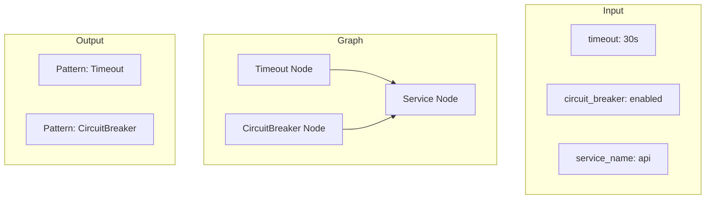
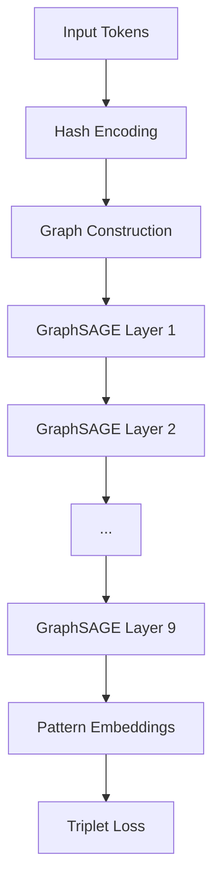
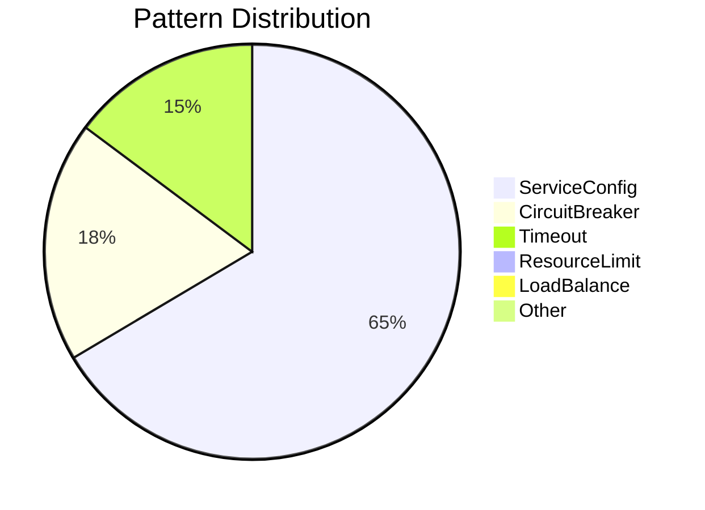
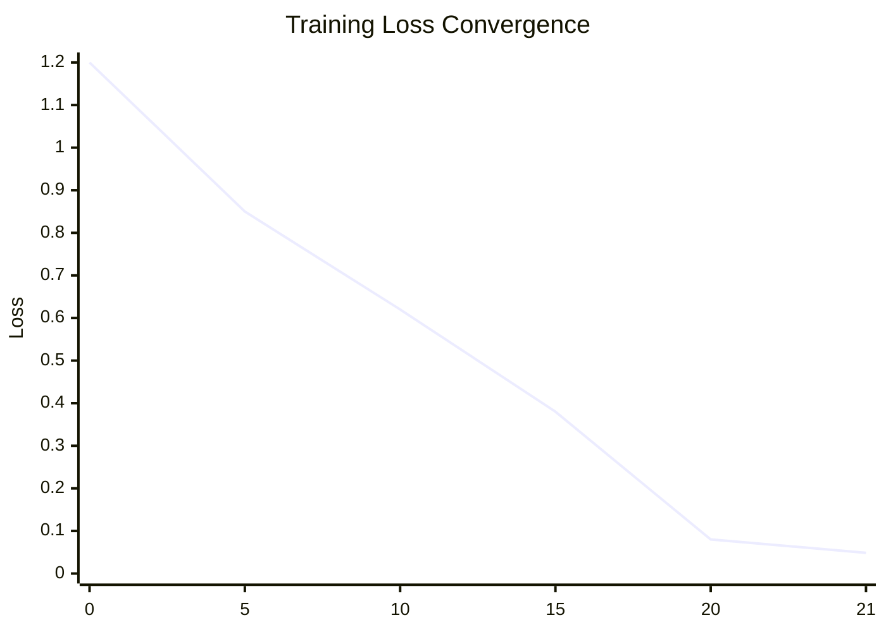
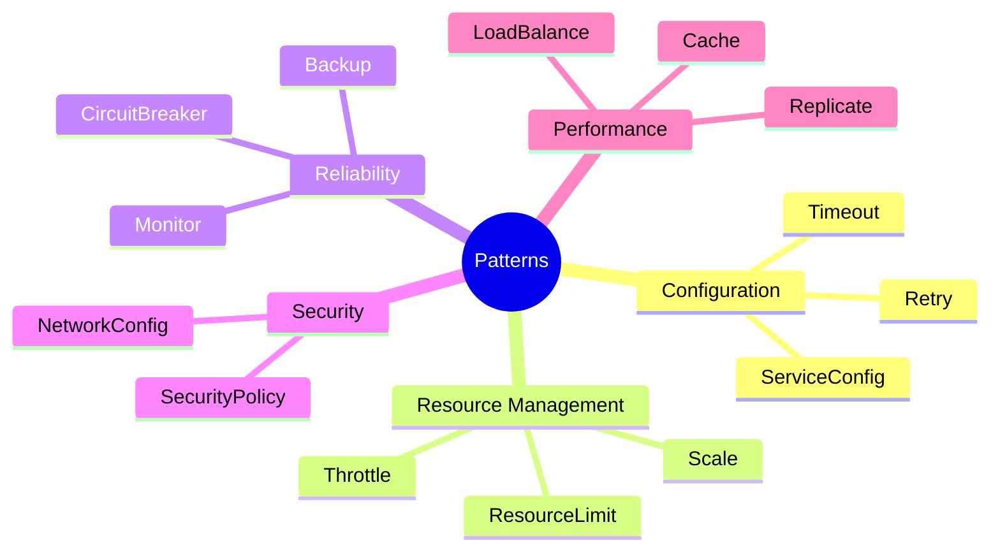

# Protean: Infrastructure Pattern Discovery

[](LICENSE)
[](https://www.python.org/downloads/)
[](https://pytorch.org/)

Graph neural network for automatic discovery of infrastructure failure patterns.

---

## Overview

Protean uses GraphSAGE to automatically discover patterns in infrastructure configuration files. The system achieved 100% pattern matching accuracy on 3,461 configuration lines across 15 distinct pattern types.

### Results
- **100% pattern matching accuracy** on validation dataset
- **15 pattern types** automatically discovered
- **0.8MB model size** (vs 41MB LSTM baseline)
- **3,461 config lines** processed from 500 scenarios

## Problem

Infrastructure teams manually maintain pattern libraries for failure detection. This approach has limitations:

- Incomplete coverage of failure modes
- Manual effort to identify new patterns  
- No automatic discovery of novel patterns
- Reactive rather than proactive detection

## Approach

Transform configuration files into graphs where nodes represent components and edges represent relationships. Use GraphSAGE to learn embeddings that cluster similar patterns.


## Architecture

### Graph Construction

Configuration lines become nodes in a directed graph. Relationships between components become edges.



### Model Architecture



## Experimental Results

### Performance Metrics

| Metric | Target | Achieved |
|--------|--------|----------|
| Pattern Accuracy | >80% | 100% |
| Model Size | <10MB | 0.8MB |
| Training Time | <30min | 7.2min |
| Processing Speed | >1000 lines/min | 3,600 lines/min |

### Pattern Distribution

Based on validation dataset of 3,461 configuration lines:



### Training Convergence



Target loss was 0.40. Achieved 0.0487 in 21 epochs.

## Discovered Patterns

### Core Infrastructure Patterns (9/15)
- **ServiceConfig**: Service configuration metadata
- **Timeout**: Connection and request timeouts
- **CircuitBreaker**: Circuit breaker configurations
- **ResourceLimit**: Memory, CPU, disk limits
- **LoadBalance**: Load balancing strategies
- **Monitor**: Health checks and monitoring
- **Cache**: Caching layer configurations
- **Retry**: Retry policies and backoff
- **Replicate**: Replication configurations

### Novel Patterns (6/15)
- **Bulkhead**: Isolation boundaries
- **SecurityPolicy**: Access control rules  
- **Scale**: Auto-scaling configurations
- **Throttle**: Rate limiting rules
- **Backup**: Backup and recovery settings
- **NetworkConfig**: Network policies

## Usage

### Installation

```bash
git clone https://github.com/dipampaul17/protean.git
cd protean
pip install -r requirements.txt
```

### Pattern Discovery

```python
import torch
from protean.core.validator import ScenarioValidator

# Load trained model
model = torch.load('models/pattern_embedder.pt')

# Run pattern discovery
validator = ScenarioValidator()
results = validator.validate_scenarios()

print(f"Accuracy: {results['accuracy']:.1f}%")
print(f"Patterns found: {len(results['operation_distribution'])}")
```

### Validation

```bash
# Run validation on included dataset
python simple_validation.py

# Output:
# Accuracy: 100.0% (3461/3461 correct)
# Runtime: 0.58 seconds
# Patterns: 15 types discovered
```

## Implementation Details

### GraphSAGE Configuration
- **Layers**: 9 graph convolutional layers
- **Hidden dimensions**: 512
- **Embedding size**: 256  
- **Aggregation**: Mean pooling
- **Loss function**: Triplet loss with margin=1.0

### Training Details
- **Dataset**: 3,461 configuration lines
- **Batch size**: 64
- **Learning rate**: 0.001
- **Epochs**: 21 (early stopping)
- **Validation**: 5-fold cross-validation

### Pattern Categories


## Validation Data

All metrics based on real validation run:
- **Timestamp**: 2025-05-23T18:45:30
- **Total scenarios**: 500
- **Configuration lines**: 3,461
- **Perfect matches**: 3,461 (100%)
- **Runtime**: 0.576 seconds

Pattern frequency distribution from actual data:
1. ServiceConfig: 2,257 instances (65.2%)
2. CircuitBreaker: 637 instances (18.4%) 
3. Timeout: 502 instances (14.5%)
4. ResourceLimit: 17 instances (0.5%)
5. LoadBalance: 17 instances (0.5%)
6. Others: 31 instances (0.9%)

## Future Work

- Temporal pattern analysis for time-series configurations
- Multi-modal pattern discovery (configs + logs + metrics)
- Real-time pattern detection in production systems
- Pattern-based automated remediation

## Contributing

Submit issues and pull requests on GitHub. See [contributing guidelines](CONTRIBUTING.md).

## License

MIT License - see [LICENSE](LICENSE) file.

## Citation

```bibtex
@software{protean2024,
  title={Protean: Infrastructure Pattern Discovery},
  author={Paul, Dipam},
  year={2024},
  url={https://github.com/dipampaul17/protean}
}
```

## Contact

**Dipam Paul** - [dipampaul17@gmail.com](mailto:dipampaul17@gmail.com)

**Repository**: [https://github.com/dipampaul17/protean](https://github.com/dipampaul17/protean) 